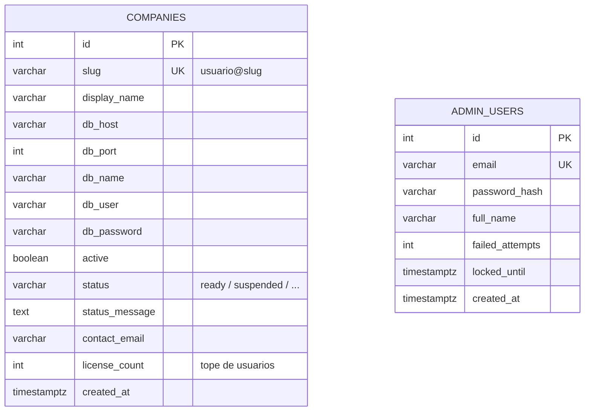
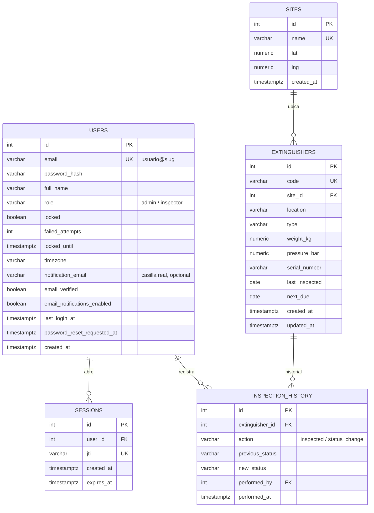

# Esquema de base de datos

FireGuard usa dos tipos de base PostgreSQL: **una única base de directorio** (`pg-directory`) que administra el catálogo de empresas y a los superadmins, y **una base independiente por empresa** (`pg-<slug>`), todas con el mismo esquema. `pg-demo` es la empresa de ejemplo — el mismo diagrama aplica a cualquier otra empresa dada de alta.

## 1. Base de directorio (`pg-directory`)

Sin relación entre sí: `companies` mapea cada empresa a su propia conexión Postgres; `admin_users` son las cuentas del panel `/admin`, no pertenecen a ninguna empresa.

## 2. Base por empresa (`pg-demo`, y una por cada cliente)

`sessions` acota usuarios concurrentes contra `companies.license_count`; `inspection_history` es el log de auditoría detrás de Reportes.
