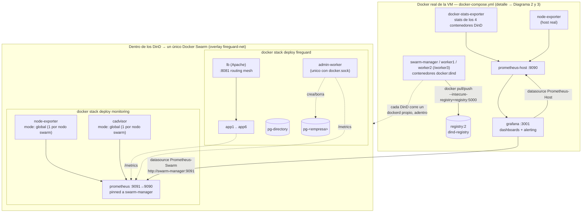
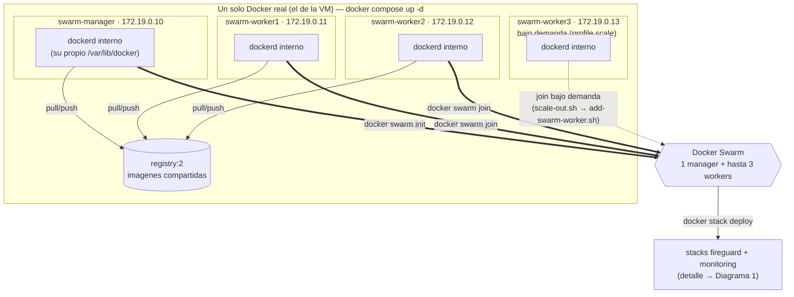
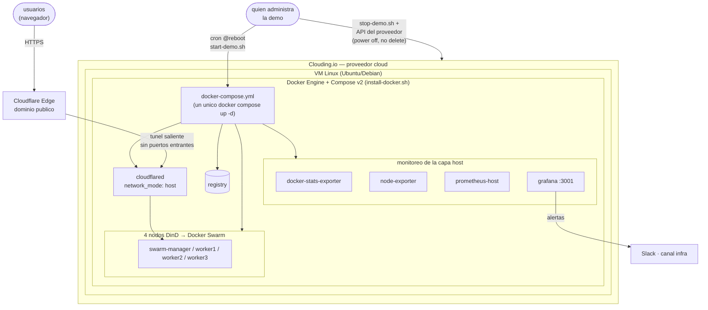

# Arquitectura Docker, de adentro hacia afuera

Tres niveles de anidamiento, cada uno detallado en su propio diagrama:

1. **Servicios dentro del Swarm** — qué corre en los stacks `fireguard` y `monitoring`, y dónde vive cada pieza de monitoreo (algunas dentro del swarm, otras un nivel más arriba).
2. **El Swarm dentro de los DinD** — cómo 4 contenedores `docker:dind`, cada uno con su propio demonio Docker, se unen entre sí para formar un único clúster Swarm, corriendo sobre un solo Docker real.
3. **Ese Docker dentro de la VM de Clouding** — el proveedor, la VM y cómo se expone y administra el ciclo de vida.

## 1. Servicios anidados en Docker Swarm

Registry y Grafana **no viven dentro del swarm** — corren en el `docker-compose.yml` de nivel superior (Diagrama 2/3). Lo único que sí vive adentro del swarm, del lado del monitoreo, es su propio stack `monitoring` (node-exporter + cadvisor + un Prometheus interno), que Grafana consulta desde afuera.

## 2. El Swarm corriendo dentro de los DinD, sobre un solo Docker

Cuatro contenedores `docker:dind` (`privileged`, `DOCKER_TLS_CERTDIR` vacío), cada uno con su **propio** demonio Docker y su propio `/var/lib/docker` — aislados entre sí como si fueran 4 máquinas. Se unen entre ellos (`docker swarm init` / `join`) sobre la red bridge `dind-net`, y como cada uno tiene su almacén de imágenes aislado, comparten un `registry` local para poder correr en cualquier nodo una imagen construida en el manager.

## 3. Ese Docker corriendo en la VM, dentro de Clouding.io

`start-demo.sh` no recrea nada (mismos datos, mismos contenedores); `stop-demo.sh` frena el stack y apaga la VM — el apagado debe ir por la API del proveedor (o una VM configurada en modo "stop" ante un `poweroff` interno), nunca un `poweroff` liso, para no perder el disco.
