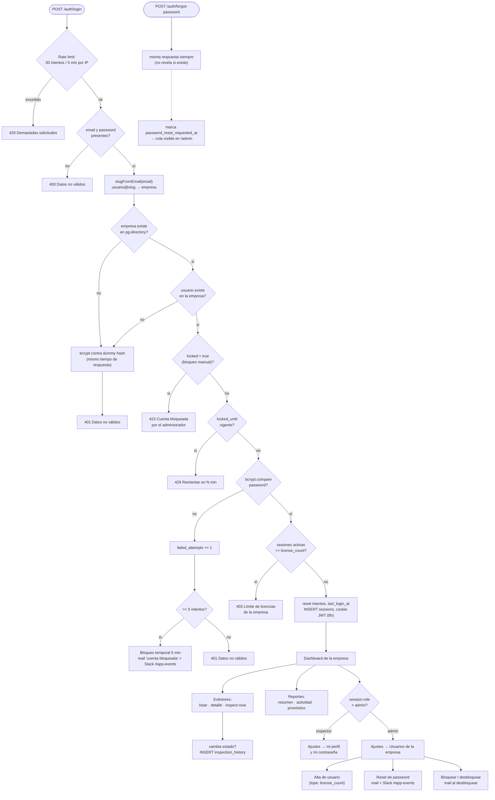
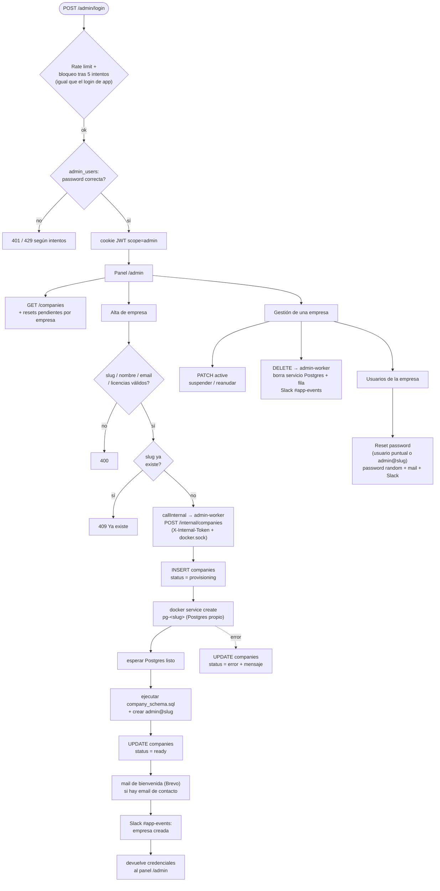

# Lógica de la aplicación

Dos flujos, calcados del código: el de la app (login de usuario, extintores, gestión de usuarios de la propia empresa) y el del panel `/admin` (login de superadmin, alta y ciclo de vida de empresas vía `admin-worker`).

## 1. App — login y uso diario (`src/routes/auth.js`, `extinguishers.js`, `settings.js`)

## 2. Panel `/admin` — superadmin y ciclo de vida de empresas (`admin.js`, `internal.js`)

`admin.js` corre en `app1`/`app2`; las operaciones que tocan Docker (crear o borrar la base de una empresa) se delegan al servicio interno `admin-worker`, el único con acceso a `docker.sock`, autenticado con un token compartido.

Los dos paneles comparten el mismo patrón de defensa: límite de intentos por cuenta (5, con bloqueo de 5 min), respuesta idéntica ante cuenta inexistente o password incorrecta (`bcrypt` contra un hash *dummy* para no filtrar tiempos), y un aviso a Slack por cada evento sensible.
